# NornicDB Architecture

**Version:** 0.1.4  
**Last Updated:** December 1, 2025

## Overview

NornicDB is a **high-performance graph database** compatible with Neo4j's Cypher query language and Bolt protocol. It combines:

- Full Neo4j protocol compatibility (Bolt, Cypher, HTTP/REST)
- Hybrid vector + graph semantics for embedding-driven applications

- **MCP Server** - Native LLM tool integration (6 tools)
- **Auto-Embedding** - Server-side embedding for vector queries
- **GPU Acceleration** - 10-100x speedup (Metal/CUDA/OpenCL/Vulkan)
- **Hybrid Search** - RRF fusion of vector + BM25

## System Architecture Diagram

```mermaid
%%{init: {'theme':'dark', 'themeVariables': { 'darkMode': true }}}%%
graph TB
    subgraph Client["🌐 Client Layer"]
        Neo4jDriver["Neo4j Driver<br/>(JavaScript/Python/Go)"]
        HTTPClient["HTTP/REST Client"]
        MCPClient["MCP Client<br/>(Cursor, Claude, etc.)"]
    end

    subgraph Security["🔒 Security Layer"]
        TLS["TLS 1.3 Encryption"]
        Auth["Authentication<br/>• Basic Auth<br/>• JWT tokens<br/>• RBAC (Admin/ReadWrite/ReadOnly)"]
    end

    subgraph Protocol["📡 Protocol Layer"]
        BoltServer["Bolt Protocol<br/>:7687"]
        HTTPServer["HTTP/REST<br/>:7474"]
        MCPServer["MCP JSON-RPC<br/>/mcp endpoint<br/>• store/recall/discover<br/>• link/task/tasks"]
    end

    subgraph Embedding["🧠 Embedding Layer"]
        EmbedQueue["Embed Worker<br/>• Background scan (15m)<br/>• Chunking (8192/50 overlap)<br/>• Retry with backoff (3x)"]
        EmbedInline["WITH EMBEDDING<br/>• Inline transactional<br/>• Same-transaction embed<br/>• CREATE/MERGE/SET"]
        EmbedCache["Embedding Cache<br/>• LRU (10K default)<br/>• 450,000x speedup"]
        EmbedService["Embedding Service<br/>• Ollama/OpenAI/Local GGUF<br/>• String query auto-embed"]
    end

    subgraph Processing["⚙️ Query Processing (CPU)"]
        CypherParser["Cypher Parser<br/>• Multi-line SET with arrays<br/>• Parameter substitution"]
        QueryExecutor["Query Executor<br/>• MATCH/CREATE/MERGE<br/>• Vector procedures<br/>• String auto-embedding"]
        TxManager["Transaction Manager<br/>• WAL durability<br/>• ACID guarantees"]
    end

    subgraph Storage["💾 Storage Layer"]
        BadgerDB["BadgerDB Engine<br/>• Streaming iteration<br/>• LSM-tree storage"]
        Schema["Schema Manager<br/>• Vector indexes<br/>• BM25 fulltext indexes<br/>• Unique constraints"]
        Persistence["Persistence<br/>• Write-ahead log<br/>• Incremental snapshots"]
    end

    subgraph GPU["🎮 GPU Acceleration"]
        GPUManager["GPU Manager<br/>• Metal (Apple Silicon)<br/>• CUDA (NVIDIA)<br/>• OpenCL/Vulkan"]
        VectorOps["Vector Operations<br/>• Cosine similarity<br/>• Batch processing<br/>• K-Means clustering"]
    end

    subgraph Search["🔍 Search & Indexing"]
        VectorSearch["Vector Search<br/>• HNSW index O(log n)<br/>• GPU-accelerated"]
        FulltextSearch["BM25 Search<br/>• Token indexing<br/>• Prefix matching"]
        HybridSearch["Hybrid RRF<br/>• Vector + BM25 fusion<br/>• Adaptive weights"]
    end

    %% Client connections
    Neo4jDriver --> TLS
    HTTPClient --> TLS
    MCPClient --> TLS

    %% Security flow
    TLS --> Auth
    Auth --> BoltServer
    Auth --> HTTPServer
    Auth --> MCPServer

    %% MCP to embedding
    MCPServer --> EmbedService
    MCPServer --> QueryExecutor

    %% Embedding flow
    EmbedService --> EmbedCache
    EmbedCache --> EmbedQueue
    EmbedQueue --> Storage
    EmbedInline --> EmbedService
    QueryExecutor --> EmbedInline

    %% Protocol to processing
    BoltServer --> CypherParser
    HTTPServer --> CypherParser
    CypherParser --> QueryExecutor
    QueryExecutor --> EmbedService
    QueryExecutor --> TxManager
    TxManager --> BadgerDB

    %% Storage interactions
    BadgerDB --> Schema
    BadgerDB --> Persistence
    Schema --> VectorSearch
    Schema --> FulltextSearch

    %% GPU acceleration
    VectorSearch --> GPUManager
    GPUManager --> VectorOps
    VectorOps --> VectorSearch

    %% Hybrid search
    VectorSearch --> HybridSearch
    FulltextSearch --> HybridSearch

    %% Styling
    classDef clientStyle fill:#1a5490,stroke:#2196F3,stroke-width:2px,color:#fff
    classDef securityStyle fill:#7b1fa2,stroke:#9C27B0,stroke-width:2px,color:#fff
    classDef protocolStyle fill:#0d47a1,stroke:#2196F3,stroke-width:2px,color:#fff
    classDef embedStyle fill:#00695c,stroke:#009688,stroke-width:2px,color:#fff
    classDef processingStyle fill:#1b5e20,stroke:#4CAF50,stroke-width:2px,color:#fff
    classDef storageStyle fill:#e65100,stroke:#FF9800,stroke-width:2px,color:#fff
    classDef gpuStyle fill:#880e4f,stroke:#E91E63,stroke-width:2px,color:#fff
    classDef searchStyle fill:#004d40,stroke:#009688,stroke-width:2px,color:#fff

    class Neo4jDriver,HTTPClient,MCPClient clientStyle
    class TLS,Auth securityStyle
    class BoltServer,HTTPServer,MCPServer protocolStyle
    class EmbedQueue,EmbedInline,EmbedCache,EmbedService embedStyle
    class CypherParser,QueryExecutor,TxManager processingStyle
    class BadgerDB,Schema,Persistence storageStyle
    class GPUManager,VectorOps gpuStyle
    class VectorSearch,FulltextSearch,HybridSearch searchStyle
```



## Design Philosophy

**Core Concept:** NornicDB consolidates the critical path for low-latency retrieval (transport, embedding, search, ranking) into a single operational unit rather than scattering these stages across microservices.

Key Design Decisions:

- **Co-located retrieval path** - In-process embedding, search orchestration, reranking, and transactional state for single-digit millisecond retrieval
- **Protocol pluralism** - Bolt/Cypher, REST/HTTP, MCP JSON-RPC, and future GraphQL/gRPC interfaces share the same underlying engine
- **Fail-open degradation** - Reranker/embedder unavailability doesn't block retrieval; system gracefully degrades
- **Runtime adaptability** - Strategy switching (CPU brute-force ↔ GPU ↔ HNSW) with configurable thresholds for resource-conscious deployment

## Data Flow

```
┌─────────────────────────────────────────────────────────────────────┐
│                    NornicDB Operational Core                         │
│                                                                      │
│  ┌────────────────────────────────────────────────────────────────┐ │
│  │  Protocol Layer: Bolt :7687 | HTTP :7474 | MCP /mcp            │ │
│  └────────────────────────────────────────────────────────────────┘ │
│                              │                                       │
│      ┌──────────────────────┼──────────────────────┐               │
│      ▼                      ▼                      ▼               │
│  ┌──────────┐          ┌────────────┐          ┌──────────┐       │
│  │ Cypher   │          │ Embedding  │          │ MCP Tools│       │
│  │ Executor │◄────────►│ Service    │◄────────►│ (6 tools)│       │
│  │          │          │            │          │          │       │
│  │ • Parse  │          │ • Auto-emb │          │ • store  │       │
│  │ • Execute│          │ • Cache    │          │ • recall │       │
│  │ • Vector │          │ • Queue    │          │ • discover│      │
│  │   procs  │          │ • WITH     │          │ • link   │       │
│  │ • WITH   │          │   EMBEDDING│          │ • tasks  │       │
│  │  EMBEDDING│         │   (inline) │          │          │       │
│  └────┬─────┘          └────────────┘          └──────────┘       │
│       │                                         └──────────┘       │
│       ▼                                                            │
│  ┌────────────────────────────────────────────────────────────────┐ │
│  │  Storage: BadgerDB + WAL + Vector Index + BM25 Index            │ │
│  └────────────────────────────────────────────────────────────────┘ │
│                                                                      │
└─────────────────────────────────────────────────────────────────────┘
```

## API Compatibility

### Protocol Support

| Operation      | Protocol  | Port     | Status |
| -------------- | --------- | -------- | ------ |
| Cypher queries | Bolt      | 7687     | ✅     |
| HTTP/REST      | HTTP      | 7474     | ✅     |
| MCP Tools      | JSON-RPC  | 7474/mcp | ✅     |
| Authentication | Basic/JWT | Both     | ✅     |

### Vector Search Features

| Feature                         | Neo4j GDS | NornicDB |
| ------------------------------- | --------- | -------- |
| Vector array queries            | ✅        | ✅       |
| String auto-embedding           | ❌        | ✅       |
| `WITH EMBEDDING` (inline embed) | ❌        | ✅       |
| Multi-line SET with arrays      | ❌        | ✅       |
| Server-side embedding           | ❌        | ✅       |
| GPU acceleration                | ❌        | ✅       |
| Embedding cache                 | ❌        | ✅       |

## Core Components

### MCP Server (`pkg/mcp`)

Optional LLM-native tool interface (Claude, Cursor, etc.) with 6 tools:

```
store    - Create/update graph nodes with metadata
recall   - Retrieve by ID, type, tags, date range
discover - Semantic search with graph traversal
link     - Create edges and relationships
task     - Create/manage tasks with status/priority
tasks    - Query tasks with filtering and sorting
```

MCP is configurable and can be disabled entirely for application-only deployments.

### Embedding Layer (`pkg/embed`)

NornicDB supports two embedding modes:

**Background Worker** (async, eventual):

- Scans for unembedded nodes every 15 minutes (configurable)
- Chunking: 8192 tokens with 50 token overlap (configurable)
- Retry with backoff (3 attempts), debounced triggers on writes
- Configurable property inclusion/exclusion and label prepending

**`WITH EMBEDDING`** (sync, transactional):

- Appended to any mutation: `CREATE ... WITH EMBEDDING RETURN ...`
- Embeds all mutated nodes inline within the same implicit transaction
- Works with CREATE, MERGE, MATCH...SET, UNWIND...MERGE
- Rolls back both data and embeddings atomically on failure
- Uses the same chunking/provider config as the background worker

**Common:**

- **LRU Cache** - 10K entries (configurable), 450,000x speedup for repeated queries
- **Providers** - Ollama, OpenAI, Local GGUF (llama.cpp)
- **Chunk-level embeddings** - Each node stores multiple chunk embeddings with metadata (model, dimensions, timestamp)

### Cypher Executor (`pkg/cypher`)

- **Vector Procedures** - `db.index.vector.queryNodes` with string auto-embedding
- **`WITH EMBEDDING`** - Inline embedding within mutation transactions (CREATE/MERGE/SET)
- **Multi-line SET** - Arrays and multiple properties in single SET

### Search Service (`pkg/search`)

- **Vector** - HNSW index, GPU-accelerated similarity
- **BM25** - Full-text with token indexing
- **Hybrid RRF** - Reciprocal Rank Fusion of both

### GPU Acceleration (`pkg/gpu`)

| Backend | Platform       | Performance |
| ------- | -------------- | ----------- |
| Metal   | Apple Silicon  | Excellent   |
| CUDA    | NVIDIA         | Highest     |
| OpenCL  | Cross-platform | Good        |
| Vulkan  | Cross-platform | Good        |

## Configuration

### Environment Variables

```bash
# Server
NORNICDB_HTTP_PORT=7474
NORNICDB_BOLT_PORT=7687

# MCP (disable with false)
NORNICDB_MCP_ENABLED=true

# Embedding provider
NORNICDB_EMBEDDING_ENABLED=true
NORNICDB_EMBEDDING_PROVIDER=ollama          # ollama | openai | local
NORNICDB_EMBEDDING_API_URL=http://localhost:11434
NORNICDB_EMBEDDING_MODEL=bge-m3
NORNICDB_EMBEDDING_DIMENSIONS=1024
NORNICDB_EMBEDDING_CACHE_SIZE=10000

# Embedding worker (background async)
NORNICDB_EMBED_SCAN_INTERVAL=15m
NORNICDB_EMBED_BATCH_DELAY=500ms
NORNICDB_EMBED_TRIGGER_DEBOUNCE=2s
NORNICDB_EMBED_MAX_RETRIES=3
NORNICDB_EMBED_CHUNK_SIZE=8192
NORNICDB_EMBED_CHUNK_OVERLAP=50

# Embedding text control
NORNICDB_EMBEDDING_PROPERTIES_INCLUDE=      # empty = all properties
NORNICDB_EMBEDDING_PROPERTIES_EXCLUDE=
NORNICDB_EMBEDDING_INCLUDE_LABELS=true

# Auth (default: disabled)
NORNICDB_AUTH=admin:password
```

### CLI

```bash
# Start with defaults
./nornicdb serve

# Custom ports
./nornicdb serve --http-port 8080 --bolt-port 7688

# Disable MCP
./nornicdb serve --mcp-enabled=false

# With auth
./nornicdb serve --auth admin:secret
```

## File Structure

```
nornicdb/
├── cmd/nornicdb/          # CLI entry point
├── pkg/
│   ├── nornicdb/          # Main DB API
│   ├── mcp/               # MCP server (6 tools)
│   ├── embed/             # Embedding service + cache
│   ├── storage/           # BadgerDB + WAL
│   ├── search/            # Vector + BM25 + RRF
│   ├── cypher/            # Query parser/executor
│   ├── bolt/              # Bolt protocol
│   ├── server/            # HTTP server
│   ├── auth/              # Authentication/RBAC
│   ├── gpu/               # GPU backends
│   │   ├── metal/         # Apple Silicon
│   │   ├── cuda/          # NVIDIA
│   │   ├── opencl/        # Cross-platform
│   │   └── vulkan/        # Cross-platform
│   ├── index/             # HNSW vector index
│   ├── linkpredict/       # Topological link prediction
│   ├── inference/         # Auto-relationship engine
│   ├── decay/             # Memory decay system
│   ├── temporal/          # Temporal data handling
│   └── retention/         # Data retention policies
├── data/                  # Persistence directory
├── ui/                    # React admin UI
└── docs/                  # Documentation
```

## Testing

```bash
# All tests
cd nornicdb && go test ./... -count=1

# Specific package
go test ./pkg/mcp/... -v

# Benchmarks
go test ./pkg/search/... -bench=.

# Integration tests
go test ./pkg/mcp/... -run Integration
```

---

_See also: [Vector Search Guide](../user-guides/vector-search.md) | [User Guides](../user-guides/README.md) | [API Reference](../api-reference/README.md)_
